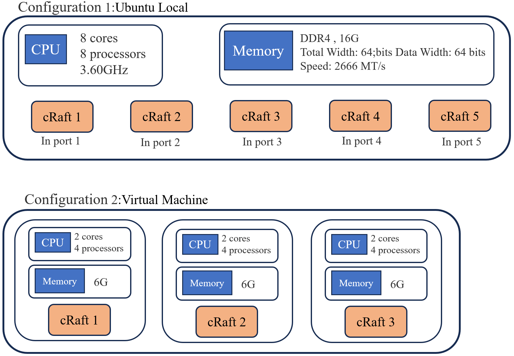

# cRaft: Raft distributed consensus algorithm service framework based on C++ stacked coroutines

> This project is open source and can be changed and used at will. Please indicate the source when using or changing the project and publishing it elsewhere(https://github.com/cq-cdy/cRaft) ,see the `LICENSE` document for details.

#### [[中文文档]](https://github.com/cq-cdy/cRaft/tree/master/zh)
---
* Based on the **lightweight and efficient design of C++ stack coroutines**
* Supports **stable operation of distributed cluster** deployment, implementing effective fault tolerance mechanisms
* Under the **pressure test of multi-concurrent synchronous logs**, it ensures the stability of the cluster in situations such as leader **downtime and going online**
* Uses design patterns such as **dependency injection and template methods** to provide interfaces that are decoupled from upper-level services
* Installation and use are quick and convenient, providing custom snapshot synchronization services
-----

#### Raft Paper：[In Search of an Understandable Consensus Algorithm (Extended Version)](https://raft.github.io/raft.pdf)
-------------------

### Environment
> ubuntu 20.04

>gcc/++ :11.4.0，C++ 20

> CMake-3.26.4

>C++ coroutine library : libgo [ [libgo-3.1-stable download and installation] ](https://github.com/yyzybb537/libgo/releases/tag/v3.1-stable)

> grpc-1.45.2  [[download link]](https://github.com/grpc/grpc)

> protobuf-3.19.4.0(Follow grpc automatic installation)

> spdlog Log library [[download link]](https://github.com/gabime/spdlog)

## Performance
Evaluation indicators: Cluster submission rate CSR (Cluster submission rate): The number of times per second that the client initiates log submission, and the cluster leader copies the log to all or most nodes before feeding it back to the client.

> Since there are not enough hardware resources, the overall test is not very rigorous. We roughly tested the response rate.

> The picture below is the test environment of the two configuration items this time.



> Approximate test results of three and five cRaft nodes in two configuration environments:


## Install and use
1.After configuring the above environment, git clone
```
git clone https://github.com/cq-cdy/cRaft
```
2.compile
```
cd cRaft
mkdir build && cd build
cmake .. && make
```
3.At this time, the static library `lib/libcraft.a` will be generated.
```
sudo cp libcraft.a /usr/local/lib
sudo cp -r craft/ /usr/local/include
sudo cp -r rpc/  /usr/local/include
```
The installation is complete, then build your own distributed service

## How to use?

#### 1.First, create a configuration file in `~/craft/craft.conf`
```makefile
id = 0
#some time out [ms]
ELECTION_TIMEOUT = 800
RPC_TIMEOUT = 100
HEART_BEAT_INTERVAL= 200

#add one line like this for each server
servers = 192.168.100.100:10156
servers = 192.168.100.101:10156
servers = 192.168.100.102:10156
servers = 192.168.100.103:10156
servers = 192.168.100.104:10156

#loglevel = DEBUG
loglevel = INFO

```
Whenever you want to add a new server, add a `servers` information, where the `id` is the serial number of the servers where the machine is located. For example, the `id` of `servers` = 192.168.100.102 is `1`, and the `id` of 192.168.100.100 is `0`.


#### 2.Create your own custom service, such as KV key-value storage service, ``KVServer.cc``, import the header file `craft/raft.h`
``` cpp
#include <thread>
#include "craft/raft.h"
#include "regex"
using namespace craft;
class KVServer : public craft::AbstractPersist {

public:
    KVServer(std::string path, std::string snapFileName)
            : AbstractPersist(std::move(path), std::move(snapFileName)) {}

    void deserialization(const char *filename) override {
        // from snapshot file load data to this object

        /*
         * some IO operation ...
         */
    }

    void serialization() override {
        // save data to snapshot file,such as this object to serialize to snapshot file
        /*
            * some IO operation ...
        */
    }

    // Some methods belonging to KV service
    void addPair(std::pair<std::string,std::string> data){
        /*  some operation*/
    }
private:
    std::map<std::string,std::string> kv_datas_;
};

int main(int argc, char **argv) {

    // start libgo coroutine
    std::thread([] { co_sched.Start(0,0); }).detach();

    //set log level
    spdlog::set_level(spdlog::level::info);

    //set snapshot and persist path
    std::string abs_path = "/home/cdy/code/projects/cRaft/.data";
    
    // set snapshot file name
    std::string snapFileName = "KVServer.snap";
    KVServer kv(abs_path, snapFileName);

    co_chan<ApplyMsg> msgCh(10000);
    craft::Raft raft(&kv, &msgCh);
    raft.launch();

    ApplyMsg msg;
    msgCh >> msg;
    spdlog::info(" get Apply msg [{},{},{}]", msg.commandValid, msg.command.content, msg.commandIndex);
    raft.saveSnapShot(msg.commandIndex);
    sleep(INT32_MAX);
}
``` 
Of course, in addition to reading from the configuration file, you can also set some parameters at runtime. It is natural that the configuration items set at runtime have a higher priority than the configuration file:
```c++
craft::Raft raft(&kv, &msgCh);
raft.setClusterAddress({"172.16.66.100:9667","172.16.66.101:9667","172.16.66.102:9667"});
raft.setRpcTimeOut(80);
raft.setHeatBeatTimeOut(150);
raft.setLeaderEelectionTimeOut(1500);
raft.setLogLevel(spdlog::level::debug);
//Make relevant settings before raft.launch()

raft.launch();
```
This is a basic distributed service deployment method. msgCh is the log entry submitted by the client to the cluster. After being synchronized to most nodes, ApplyMsg will be returned from msgCh, and snapshots at any time can be saved freely. The final decision was not to provide blocking in the craft service, so the blocking `sleep(INT32_MAX);` of the upper-layer service was needed. At the same time, regarding the use of the libgo coroutine framework, on top of craft, be sure to use `std::thread([] { co_sched. Start(0,0); }).detach();` is placed in the first line to start the coroutine, and the snapshot backup between clusters supports automatic and asynchronous streaming transmission, so it can well cope with subsequent large snapshot files backup.

#### 3.Client usage
touch  `client.cc`
``` c++
#include "craft/client.h"

int main(int argc, char **argv) {
    spdlog::set_level(spdlog::level::debug);
    std::string command =
            "{"
            "\"id\":\"adksra4312768dsdhk\""
            ",\"op\":\"delete\""
            ",\"from\":\"172.16.66.100:12345\""
            "}";
    CRaftClient client;
    ClientResult res = client.submitCommand(command);
    if (!res.is_timeout) {
        spdlog::info("success submit a log,term = [{}],index = [{}]", res.term, res.index);
    } else {
       spdlog::error("submit log faild - time out");
    }
    return 0;
}
```
The client encapsulates gRPC requests. The client currently does not provide an API for changing related parameters at runtime like the server does. Therefore, currently the client can only read relevant information from the configuration file and obtain the added log through the `ClientResult` return value. `term` and `index`

#### 4.Compile and run your service
Create `CMakeLists.txt`, and copy the `common.cmake` file to the directory where your CMakeLists.txt is located. Of course, you must ensure that the environment libraries mentioned above have been installed before this.
```cmake
cmake_minimum_required(VERSION 3.2)
set(CMAKE_CXX_STANDARD 20)
set(CMAKE_CXX_STANDARD_REQUIRED ON)
...
project(KVserver C CXX)
include(common.cmake)
...
foreach(_target KVServer client)
add_executable(${_target} "${_target}.cc")
target_link_libraries(${_target}

craft
absl::flags
absl::flags_parse
${_REFLECTION}
${_GRPC_GRPCPP}
${_PROTOBUF_LIBPROTOBUF}
libgo
dl
pthread)
endforeach()
```
You can then perform these steps on other nodes to start your own distributed system.

## Next
Currently, the function of dynamically bringing nodes online and offline is not provided and will be considered in the future. The logs have not yet been placed on disk. Cluster communication may not be smooth during the second startup in a short period of time. This seems to be a feature of grpc. When I was debugging, every time If you have to change the port again, cluster communication will be no problem. I also tried to set up the following port reuse for grpc, but it didn't seem to work. I'm waiting for someone who knows to help point it out.
``` c++
...
int a =1;
builder.AddListeningPort(server_address, grpc::InsecureServerCredentials(),&a);
builder.AddChannelArgument(GRPC_ARG_ALLOW_REUSEPORT, 1);
...
```
* cRaft refers to [MIT 6.824 lab’s golang code](https://github.com/1345414527/MIT6.824-2022/tree/master/raft)
